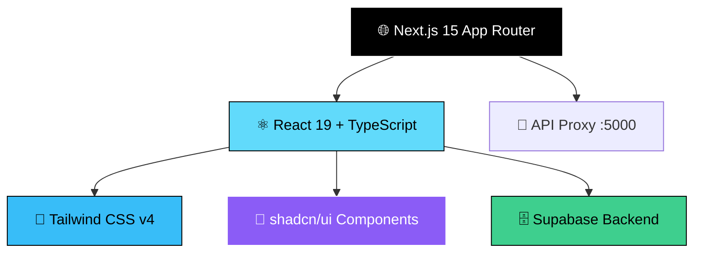
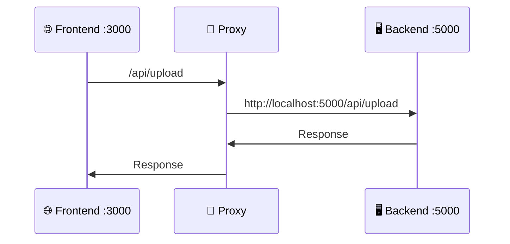

# 🏷️ CLAUDE.md

<div align="center">


**Whisky Recommendation Service - Frontend Application**

</div>

---

This file provides guidance to Claude Code (claude.ai/code) when working with code in this repository.

## 🚀 Development Commands

### 🛠️ Core Development
| Command | Description | URL |
|---------|-------------|-----|
| `npm run dev` | 🔥 Start development server with Turbopack | [localhost:3000](http://localhost:3000) |
| `npm run build` | 📦 Build production application | - |
| `npm run start` | 🌟 Start production server | - |

### ✨ Code Quality
| Command | Description |
|---------|-------------|
| `npm run lint` | 🔍 Lint code with Biome and auto-fix issues |
| `npm run format` | 💅 Format code with Biome |
| `npm run check` | ✅ Run Biome linting and formatting checks with auto-fix |
| `npm run reporter` | 📊 Generate summary report of code quality issues |

## 🏗️ Architecture Overview

<div align="center">



</div>

This is a **Next.js 15** frontend application using the App Router architecture with **TypeScript** and **React 19**. The project is configured as "Tagly" but serves as a whisky recommendation service called **"Antiplan"** 🥃.

### 🛡️ Key Technologies

<table>
<tr>
<td>

**Frontend Stack**
- 🖼️ **Next.js 15** - App Router + Turbopack
- ⚛️ **React 19** - Latest React features
- 📝 **TypeScript** - Type safety
- 🎨 **Tailwind CSS v4** - Styling system

</td>
<td>

**UI & Components**
- 🧩 **shadcn/ui** - Component system
- 🔘 **Radix UI** - Accessible primitives
- 📱 **Responsive Design** - Mobile-first
- 🌙 **Dark Mode** - Default theme

</td>
</tr>
<tr>
<td>

**Backend & Data**
- 🗄️ **Supabase** - Backend services
- 🔐 **Authentication** - User management
- 📊 **Database** - PostgreSQL

</td>
<td>

**Developer Experience**
- 🔍 **Biome** - Linting & formatting
- 📋 **React Hook Form** - Form handling
- ✅ **Zod** - Schema validation
- 🚀 **use-funnel** - Multi-step flows

</td>
</tr>
</table>

### 📁 Project Structure

```
🏠 tagly-front/
├── 📱 src/
│   ├── 🏠 app/                    # Next.js App Router pages
│   │   ├── 🎨 layout.tsx         # Root layout (Korean, fonts, dark theme)
│   │   ├── 🏡 page.tsx           # Home page
│   │   └── 📷 ocr/               # OCR functionality
│   ├── 🧩 components/ui/         # shadcn/ui components
│   ├── 📚 lib/
│   │   ├── 🗄️ supabase.ts        # Supabase client
│   │   └── 🛠️ utils.ts           # Utility functions
│   └── 🔗 shared/hooks/          # Shared React hooks
├── 🎨 public/                     # Static assets
└── ⚙️ Configuration files
```

### 🔌 API Configuration

<div align="center">



</div>

- 🔄 API routes proxied to `http://localhost:5000/api/*`
- 🖥️ Backend expected on port **5000** for development
- 📷 OCR functionality integrated

### 🔐 Environment Setup

Create a `.env.local` file with:

```env
# 🗄️ Supabase Configuration
NEXT_PUBLIC_SUPABASE_URL=your_supabase_url
NEXT_PUBLIC_SUPABASE_ANON_KEY=your_supabase_anon_key
```

### 💅 Code Style Guidelines

<div align="center">

| Setting | Value | Description |
|---------|-------|-------------|
| 🔢 **Indentation** | 2 spaces | Clean, minimal spacing |
| 💬 **Quotes** | Double quotes | Consistent string formatting |
| 📏 **Line Width** | 120 chars | Readable line length |
| 🔄 **Import Sort** | Automated | Auto-organized imports |
| 🌍 **Language** | Korean (kr) | Localized for Korean users |
| 🎨 **Theme** | Dark default | Geist fonts included |

</div>

---

<div align="center">

**🏷️ Built with ❤️ for Whisky Enthusiasts 🥃**


</div>